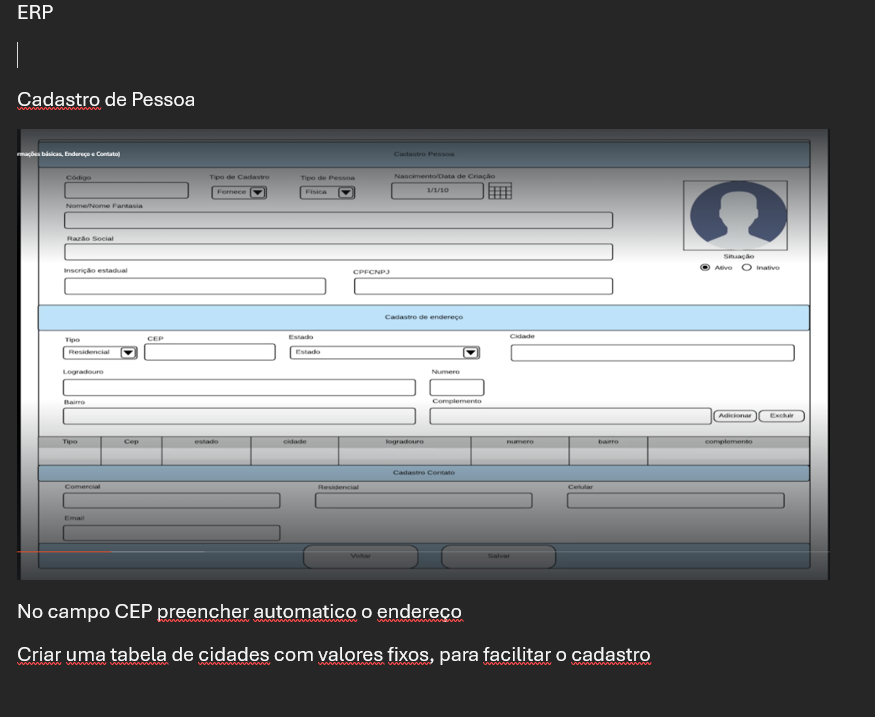

# Tarefa Inicial do Sistema ERP - Cadastro de Pessoa (Clientes)

O projeto Laravel já está criado e estamos utilizando o **HERD** como ambiente local.

## ✅ Primeiras Ações:
1. Instalar **Livewire** e **Filament**.
2. Criar o módulo de **cadastro de clientes/pessoas** usando o **Filament**.
3. Autenticação (login) básica utilizando Filament (admin UI).

---

## 🧩 Tela a ser desenvolvida: Cadastro de Pessoa

Segue um exemplo da tela desejada:
> 

A ideia é construir essa tela utilizando componentes do **Filament**. Veja os detalhes para a estrutura:

---

## 📝 Campos e Seções da Tela

### 1. Cabeçalho – Cadastro de Pessoa
- **Código** (auto numérico ou UUID)
- **Tipo de Cadastro**: Select (Fornecedor, Cliente, etc.)
- **Tipo de Pessoa**: Select (Física, Jurídica)
- **Nascimento/Data de Criação**: Date picker
- **Nome/Nome Fantasia**: Texto
- **Razão Social**: Texto
- **Inscrição Estadual**: Texto
- **CPF/CNPJ**: Texto
- **Situação**: Radio (Ativo / Inativo)
- **Foto do Perfil**: Upload de imagem

### 2. Seção: Cadastro de Endereço
- Pode permitir múltiplos endereços
- Campos:
    - Tipo: Select (Residencial, Comercial)
    - CEP: Texto (com preenchimento automático do endereço via API Externa)
    - Estado: Select
    - Cidade: Select (usando uma tabela com cidades fixas)
    - Logradouro: Texto
    - Número: Texto
    - Bairro: Texto
    - Complemento: Texto
    - Botões: **Adicionar** / **Excluir**

### 3. Seção: Cadastro de Contato
- Comercial / Residencial
- Campos:
    - Email: Texto
    - Celular: Texto

---

## 📌 Funcionalidades extras
- No campo **CEP**, preencher automaticamente os dados de endereço utilizando uma API como ViaCEP.
- Criar uma **tabela de cidades com valores fixos** para facilitar o preenchimento e evitar erros.
- Botões de ação: Voltar, Salvar

---

## ✅ O que já está pronto
- Laravel instalado
- Projeto rodando com **HERD**

---

## 🔄 Etapas Futuras (após essa tela)
- Listagem com filtros
- Edição/Exclusão
- Integração com outros módulos do ERP
