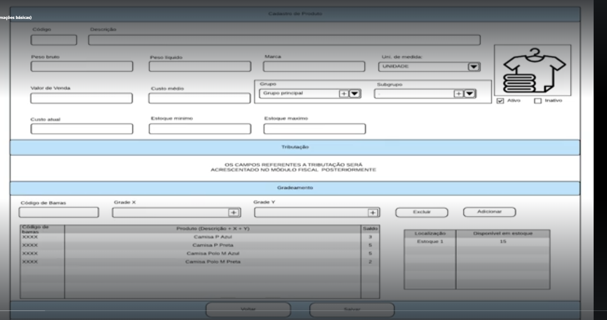

# 🧾 Solicitação de Cadastro Completo de Produto - Laravel + Filament

## Contexto:
O sistema Laravel já possui gerenciamento de Grupos e Subgrupos de produtos. Com base na imagem anexa, solicito a criação da tela completa de **Cadastro de Produto**, com todos os campos exibidos, utilizando **Filament**.

O item deve ser adicionado ao **menu principal**, acima do item de "Grupo de Produtos".

---

## 🧩 Seção: Informações Básicas

| Campo             | Tipo         |
|------------------|--------------|
| Código            | Texto        |
| Descrição         | Texto        |
| Peso bruto        | Numérico     |
| Peso líquido      | Numérico     |
| Marca             | Texto        |
| Unidade de medida | Select       |
| Grupo             | Relacional (select) |
| Subgrupo          | Relacional (select dependente de Grupo) |
| Imagem do produto | Upload       |
| Status            | Checkbox (Ativo / Inativo) |

---

## 💰 Seção: Estoque e Preços

| Campo           | Tipo     |
|----------------|----------|
| Valor de Venda  | Monetário |
| Custo médio     | Monetário |
| Custo atual     | Monetário |
| Estoque mínimo  | Numérico  |
| Estoque máximo  | Numérico  |

---

## 🧾 Seção: Tributação

- **Observação**: "Os campos referentes à tributação serão acrescentados no módulo fiscal posteriormente".
- Deixe um **placeholder ou aviso informativo** nesta seção.

---

## 🧮 Seção: Gradeamento

Campos para definir combinações de grade (X e Y):

| Campo            | Tipo     |
|------------------|----------|
| Código de Barras | Texto    |
| Grade X          | Texto    |
| Grade Y          | Texto    |
| Tabela de variações | Automática com base nas combinações |

Tabela exibida com colunas:
- Código de Barras
- Produto (Descrição + X + Y)
- Saldo

Informar também:
- Localização no estoque
- Quantidade disponível

Ações esperadas:
- Botões de "Adicionar" e "Excluir" para combinações
- Visualização do total disponível

---

## 🎯 Requisitos Técnicos

- Utilizar **Filament Resources** para criação do CRUD completo.
- Adicionar o item **"Produtos"** no menu lateral **acima de Grupo de Produtos**.
- Organização da interface conforme imagem, com agrupamento em seções visuais.
- Relacionar produto com **grupo e subgrupo já existentes**.
- Permitir upload de imagem do produto.
- Placeholder informativo na seção de tributação.

---

📎 **Imagem de referência**: 

Imagem anexa ao pedido com a estrutura visual completa do formulário de cadastro de produto.
