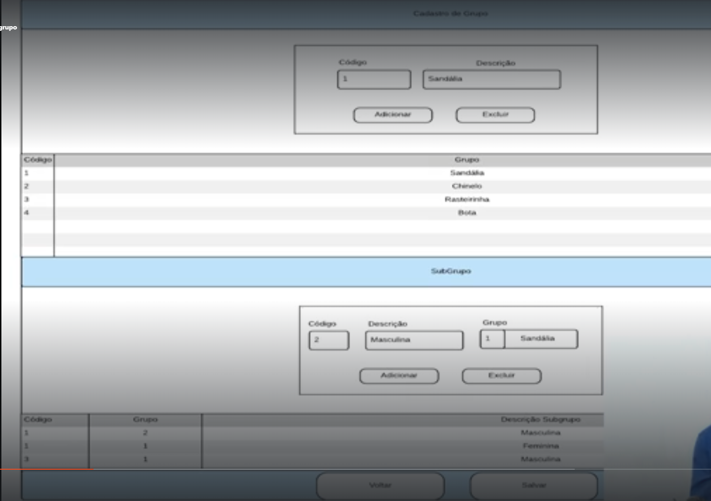

# 🧾 Solicitação de Cadastro de Produtos com Grupo e Subgrupo - Laravel + Filament

## Contexto:
O projeto Laravel já está estruturado com o Filament Admin. Preciso que seja criado um novo módulo para **Cadastro de Produtos**, com suporte a **Grupos** e **Subgrupos**, conforme layout da imagem em anexo.

## Objetivo:
Criar uma interface de administração que permita cadastrar grupos e subgrupos de produtos, associando-os corretamente. Utilizar componentes do Filament (Forms, Tables, Resources) e adicionar os itens ao menu principal.

---

## 📁 Cadastro de Grupo

| Campo      | Tipo  |
|------------|-------|
| Código     | Texto |
| Descrição  | Texto |

Ações esperadas:
- Botões de "Adicionar" e "Excluir"
- Tabela exibindo os grupos cadastrados com colunas: Código e Descrição

---

## 📁 Cadastro de Subgrupo

| Campo      | Tipo       |
|------------|------------|
| Código     | Texto      |
| Descrição  | Texto      |
| Grupo      | Relacional (select de grupos) |

Ações esperadas:
- Botões de "Adicionar" e "Excluir"
- Tabela exibindo os subgrupos cadastrados com colunas: Código, Grupo (nome), Descrição

---

## 🎯 Requisitos técnicos

- Utilizar **Filament Resources** para criar telas de gerenciamento (Grupo e Subgrupo).
- Adicionar ambos os recursos ao **menu lateral** do painel administrativo.
- As telas devem refletir a organização apresentada na imagem anexa:
  - Seções separadas para Grupo e Subgrupo.
  - Formulários simples, com botões de ação e tabelas de visualização.
- O relacionamento entre Grupo e Subgrupo deve ser mantido no banco.

---

📎 **Imagem de referência**: 

Imagem anexa ao pedido com a estrutura visual desejada para a funcionalidade.

