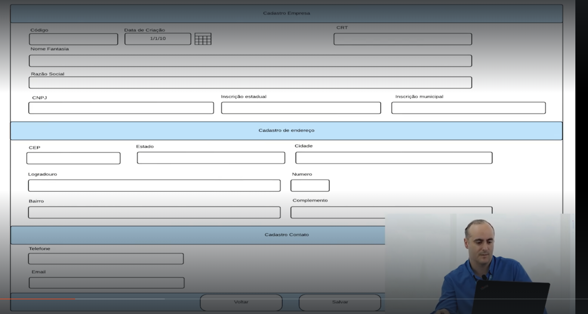

# 🧾 Solicitação de Criação de Tela de Cadastro - Laravel + Filament

## Contexto:
O projeto Laravel já está configurado e utiliza o Filament Admin. Preciso que seja criada uma nova tela de **cadastro de empresas** conforme o layout apresentado na imagem anexa.

## Objetivo:
Criar um form de **Cadastro de Empresa** com os seguintes campos organizados em seções (cards ou fieldsets, conforme o design padrão do Filament).

---

## 📁 Seção: Dados da Empresa

| Campo               | Tipo          |
|---------------------|---------------|
| Código              | Texto         |
| Data de Criação     | Data          |
| CRT                 | Texto         |
| Nome Fantasia       | Texto         |
| Razão Social        | Texto         |
| CNPJ                | Texto         |
| Inscrição Estadual  | Texto         |
| Inscrição Municipal | Texto         |

---

## 🏠 Seção: Cadastro de Endereço

| Campo       | Tipo      |
|-------------|-----------|
| CEP         | Texto     |
| Estado      | Texto     |
| Cidade      | Texto     |
| Logradouro  | Texto     |
| Número      | Texto     |
| Bairro      | Texto     |
| Complemento | Texto     |

---

## 📞 Seção: Contato

| Campo   | Tipo  |
|---------|-------|
| Telefone| Texto |
| Email   | Texto |

---

## 🎯 Requisitos técnicos

- Utilizar os recursos de **Forms** do Filament.
- Organizar os campos em seções com títulos como na imagem:
  - "Cadastro Empresa"
  - "Cadastro de endereço"
  - "Cadastro Contato"
- Os campos podem ser simples, não há necessidade de validações complexas nesta etapa.
- Adicionar botões de "Voltar" e "Salvar" no final do formulário.
- O layout não precisa ser idêntico à imagem, mas deve manter a mesma lógica de agrupamento dos campos.

---

📎 **Imagem de referência**:  

Imagem anexa ao pedido com a estrutura visual da tela desejada.
